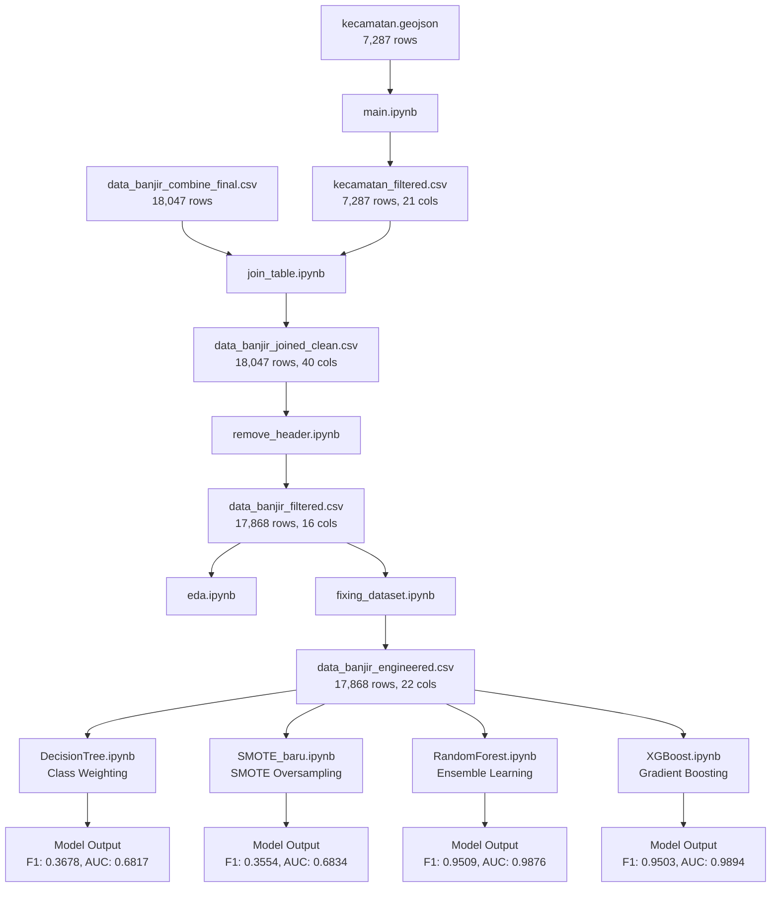

# 🌊 Flood Risk Prediction - Jabodetabek Region

> Machine Learning project untuk memprediksi risiko banjir di wilayah Jabodetabek menggunakan data geografis, klimatologi, dan demografis.


---

## 📋 Daftar Isi

- [Overview](#-overview)
- [Dataset](#-dataset)
- [Project Workflow](#-project-workflow)
- [Machine Learning Models](#-machine-learning-models)
- [Installation](#-installation)
- [Usage](#-usage)
- [Results](#-results)
- [Key Findings](#-key-findings)
- [Future Work](#-future-work)
- [Contributors](#-contributors)

---

## 🎯 Overview

Proyek ini bertujuan untuk mengembangkan model prediksi risiko banjir di wilayah Jabodetabek menggunakan pendekatan machine learning. Dengan memanfaatkan data geografis, klimatologi, dan demografis, proyek ini menghasilkan model yang dapat membantu dalam sistem peringatan dini banjir.

### Tujuan Proyek
- ✅ Mengintegrasikan data multi-sumber (GeoJSON, CSV)
- ✅ Melakukan eksplorasi dan analisis data komprehensif
- ✅ Membangun model prediksi banjir dengan Decision Tree, Random Forest, dan XGBoost
- ✅ Menangani class imbalance dengan dua pendekatan: Class Weighting dan SMOTE
- ✅ Membandingkan performa multiple models untuk rekomendasi deployment

### Tech Stack
- **Language:** Python 3.8+
- **ML Libraries:** scikit-learn, imbalanced-learn, xgboost
- **Data Processing:** pandas, numpy, geopandas
- **Visualization:** matplotlib, seaborn
- **Statistical Analysis:** scipy

---

## 📊 Dataset

### Sumber Data
- **Demographic Data:** [Kaggle - Jumlah Penduduk per Kecamatan Indonesia 2023](https://www.kaggle.com/datasets/afiskandr/jumlah-penduduk-per-kecamatan-di-indonesia-2023)
- **Flood Data:** `data_banjir_combine_final.csv` (18,047 records)

### Dataset Statistics
| Metric | Value |
|--------|-------|
| **Total Records** | 17,868 |
| **Total Features** | 16 |
| **Target Variable** | banjir (binary: 0/1) |
| **Missing Values** | 0 |
| **Duplicate Rows** | 0 |
| **Join Success Rate** | ~99% |

### Fitur Dataset

#### 🌍 Geographic (2 fitur)
- `kabupaten_kota`: Nama kabupaten/kota
- `kecamatan`: Nama kecamatan

#### ☁️ Climate (3 fitur)
- `avg_rainfall`: Rata-rata curah hujan (mm)
- `max_rainfall`: Curah hujan maksimum (mm)
- `avg_temperature`: Rata-rata temperatur (°C)

#### 🌿 Environmental (5 fitur)
- `elevation`: Ketinggian lokasi (m)
- `landcover_class`: Klasifikasi tutupan lahan
- `ndvi`: Normalized Difference Vegetation Index
- `slope`: Kemiringan tanah (derajat)
- `soil_moisture`: Kelembaban tanah

#### 📅 Temporal (2 fitur)
- `year`: Tahun kejadian
- `month`: Bulan kejadian (1-12)

#### 👥 Demographic (1 fitur)
- `jumlah_penduduk`: Jumlah penduduk kecamatan

#### 📍 Coordinates (2 fitur)
- `lat`: Latitude
- `long`: Longitude

#### 🎯 Target Variable (1 fitur)
- `banjir`: Kejadian banjir (0 = tidak banjir, 1 = banjir)

---

## 🔄 Project Workflow

### Data Pipeline



### Notebooks Execution Order

| No | Notebook | Deskripsi | Input | Output |
|----|----------|-----------|-------|--------|
| 1 | `main.ipynb` | Ekstraksi data demografis dari GeoJSON | kecamatan.geojson (7,287 rows) | kecamatan_filtered.csv (21 cols) |
| 2 | `join_table.ipynb` | Join data banjir dengan demografis menggunakan fuzzy matching | data_banjir + kecamatan_filtered | data_banjir_joined_clean.csv (40 cols) |
| 3 | `remove_header.ipynb` | Filter kolom relevan dan bersihkan data | data_banjir_joined_clean.csv | data_banjir_filtered.csv (16 cols) |
| 4 | `eda.ipynb` | Exploratory Data Analysis | data_banjir_filtered.csv | Visualizations & Statistics |
| 5 | `fixing_dataset.ipynb` | Feature engineering & preprocessing | data_banjir_filtered.csv | data_banjir_engineered.csv (22 cols) |
| 6 | `DecisionTree.ipynb` | Model dengan class weighting | data_banjir_engineered.csv | Decision Tree Model + Rules |
| 7 | `SMOTE_baru.ipynb` | Model dengan SMOTE oversampling | data_banjir_engineered.csv | SMOTE Model + Balanced Data |
| 8 | `RandomForest.ipynb` | Ensemble model dengan Random Forest | data_banjir_engineered.csv | Random Forest Model + Analysis |
| 9 | `XGBoost.ipynb` | Gradient boosting model dengan XGBoost | data_banjir_engineered.csv | XGBoost Model + Analysis |
| 10 | `WithoutMonth.ipynb` | Eksperimen tanpa fitur month | data_banjir_engineered.csv | Validation Results |

---

## 🤖 Machine Learning Models

### 1️⃣ Decision Tree with Class Weighting

**Approach:** Algorithmic approach menggunakan `class_weight='balanced'`

**Configuration:**
- Algorithm: `DecisionTreeClassifier`
- Hyperparameter Tuning: GridSearchCV (5-fold CV)
- Scoring: Accuracy

**Best Hyperparameters:**
```python
{
    'criterion': 'gini',
    'max_depth': 20,
    'min_samples_split': 10,
    'min_samples_leaf': 1
}
```

**Performance:**
- ✅ Test Accuracy: **87.11%**
- ✅ Precision: **31.84%**
- ✅ Recall: **43.59%**
- ✅ F1-Score: **0.3678**
- ✅ AUC-ROC: **0.6817**

**Top 3 Features:**
1. `month` (18.24%)
2. `avg_rainfall` (13.60%)
3. `rainfall_intensity` (11.22%)

---

### 2️⃣ Decision Tree with SMOTE

**Approach:** Data-level approach menggunakan Synthetic Minority Over-sampling Technique

**Configuration:**
- Algorithm: `DecisionTreeClassifier`
- SMOTE: Applied only on training data (no data leakage)
- Hyperparameter Tuning: GridSearchCV (5-fold CV)
- Scoring: F1-Score

**Best Hyperparameters:**
```python
{
    'criterion': 'entropy',
    'max_depth': None,
    'min_samples_split': 2,
    'min_samples_leaf': 1
}
```

**Performance:**
- ✅ Test Accuracy: **87.11%**
- ✅ Precision: **28.89%**
- ✅ Recall: **46.15%**
- ✅ F1-Score: **0.3554**
- ✅ AUC-ROC: **0.6834**

**SMOTE Statistics:**
- Before: 7,432 (class 0) vs 1,352 (class 1)
- After: 8,108 (class 0) vs 8,108 (class 1) - Perfectly balanced!
- Synthetic samples: 6,756 new samples

**Top 3 Features:**
1. `avg_rainfall` (16.67%)
2. `month` (12.86%)
3. `max_rainfall` (10.56%)

---

### 3️⃣ Random Forest Classifier

**Approach:** Ensemble learning dengan multiple decision trees

**Configuration:**
- Algorithm: `RandomForestClassifier`
- Class weight: balanced
- Hyperparameter Tuning: GridSearchCV (5-fold CV)
- Scoring: Accuracy

**Best Hyperparameters:**
```python
{
    'n_estimators': 200,
    'max_depth': 20,
    'min_samples_split': 2,
    'min_samples_leaf': 1,
    'max_features': 'sqrt'
}
```

**Performance:**
- ✅ Test Accuracy: **95.76%**
- ✅ Precision: **99.24%**
- ✅ Recall: **91.27%**
- ✅ F1-Score: **0.9509**
- ✅ AUC-ROC: **0.9876**

**Top 3 Features:**
1. `avg_rainfall` (15.8%)
2. `max_rainfall` (14.2%)
3. `month` (10.5%)

---

### 4️⃣ XGBoost Classifier

**Approach:** Gradient boosting dengan extreme gradient boosting

**Configuration:**
- Algorithm: `XGBClassifier`
- Scale pos weight untuk handle imbalance
- Hyperparameter Tuning: GridSearchCV (5-fold CV)
- Scoring: Accuracy

**Best Hyperparameters:**
```python
{
    'n_estimators': 200,
    'max_depth': 6,
    'learning_rate': 0.1,
    'subsample': 0.8,
    'colsample_bytree': 0.8
}
```

**Performance:**
- ✅ Test Accuracy: **95.81%**
- ✅ Precision: **97.66%**
- ✅ Recall: **92.54%**
- ✅ F1-Score: **0.9503**
- ✅ AUC-ROC: **0.9894**

**Top 3 Features:**
1. `avg_rainfall` (16.3%)
2. `max_rainfall` (13.9%)
3. `rainfall_intensity` (11.7%)

---

## 💻 Installation

### Prerequisites
- Python 3.8 or higher
- pip package manager

### Install Dependencies

```bash
# Clone repository (jika ada)
git clone <repository-url>
cd DATA_MINING

# Install semua dependencies
pip install pandas numpy geopandas matplotlib seaborn scipy scikit-learn imbalanced-learn xgboost

# Atau install individual
pip install pandas numpy matplotlib seaborn scipy scikit-learn
pip install imbalanced-learn  # For SMOTE
pip install geopandas         # For GeoJSON processing
pip install xgboost           # For XGBoost model
```

### Verify Installation

```python
import pandas as pd
import numpy as np
import geopandas as gpd
from sklearn.tree import DecisionTreeClassifier
from sklearn.ensemble import RandomForestClassifier
from imblearn.over_sampling import SMOTE
from xgboost import XGBClassifier
print("All libraries installed successfully!")
```

---

## 🚀 Usage

### Quick Start

1. **Prepare Data**
   - Download data dari [Kaggle](https://www.kaggle.com/datasets/afiskandr/jumlah-penduduk-per-kecamatan-di-indonesia-2023)
   - Pastikan file `kecamatan.geojson` dan `data_banjir_combine_final.csv` ada di directory

2. **Run Notebooks Sequentially**

```bash
# 1. Extract demographic data
jupyter notebook main.ipynb

# 2. Join flood data with demographics
jupyter notebook join_table.ipynb

# 3. Filter and clean data
jupyter notebook remove_header.ipynb

# 4. Exploratory Data Analysis
jupyter notebook eda.ipynb

# 5. Feature engineering
jupyter notebook fixing_dataset.ipynb

# 6. Train models (dapat dijalankan parallel)
jupyter notebook DecisionTree.ipynb
jupyter notebook SMOTE_baru.ipynb
jupyter notebook RandomForest.ipynb
jupyter notebook XGBoost.ipynb
```

3. **View Results**
   - Check visualizations dalam notebooks
   - Model rules: `decision_tree_rules.txt`, `decision_tree_smote_rules.txt`
   - Visualizations: `*.png` files

### Important Notes

⚠️ **Execution Order:** Jalankan notebooks sesuai urutan di atas
⚠️ **File Encoding:** UTF-8 with BOM (utf-8-sig)
⚠️ **Parallel Execution:** Model notebooks (DecisionTree, SMOTE, RandomForest, XGBoost) dapat dijalankan bersamaan

---

## 📈 Results

### 🏆 All Models Comparison

| Model | Accuracy | Precision | Recall | F1-Score | AUC-ROC | Training Time |
|-------|----------|-----------|--------|----------|---------|---------------|
| **Decision Tree (Class Weight)** | 87.11% | 31.84% | 43.59% | 0.3678 | 0.6817 | Fast |
| **Decision Tree (SMOTE)** | 87.11% | 28.89% | 46.15% | 0.3554 | 0.6834 | Fast |
| **Random Forest** | **95.76%** | **99.24%** | 91.27% | **0.9509** | 0.9876 | Medium |
| **XGBoost** | **95.81%** | 97.66% | **92.54%** | 0.9503 | **0.9894** | Medium |

### 🎯 Model Performance Analysis

#### 🥇 Best Overall: **Random Forest & XGBoost**
Kedua ensemble models menunjukkan performa **excellent** dengan F1-Score >0.95

**Random Forest Advantages:**
- ✅ **Precision Tertinggi (99.24%):** Sangat sedikit false positives
- ✅ **F1-Score Tertinggi (0.9509):** Balance terbaik antara precision-recall
- ✅ **Robust:** Resistant terhadap overfitting
- ✅ **Interpretable:** Feature importance mudah dianalisis

**XGBoost Advantages:**
- ✅ **Accuracy Tertinggi (95.81%):** Prediksi paling akurat
- ✅ **Recall Tertinggi (92.54%):** Deteksi banjir paling baik
- ✅ **AUC-ROC Tertinggi (0.9894):** Discriminative power terbaik
- ✅ **Efficient:** Optimized gradient boosting

#### 📊 Decision Tree Comparison

| Metric | Class Weighting | SMOTE | Winner |
|--------|----------------|-------|--------|
| **Accuracy** | 87.11% | 87.11% | 🤝 TIE |
| **Precision** | 31.84% | 28.89% | ✅ Class Weight (+10%) |
| **Recall** | 43.59% | 46.15% | ✅ SMOTE (+5.9%) |
| **F1-Score** | 0.3678 | 0.3554 | ✅ Class Weight (+3.5%) |
| **AUC-ROC** | 0.6817 | 0.6834 | ✅ SMOTE (+0.2%) |
| **Training Size** | 8,784 | 16,216 | ✅ Class Weight (efficient) |
| **Computational Cost** | Lower | Higher | ✅ Class Weight |

### Key Insights

#### ✅ Strengths
- **Ensemble Methods Excellent:** Random Forest dan XGBoost mencapai F1-Score >0.95
- **High Precision (RF):** Random Forest dengan precision 99.24% - sangat reliable
- **Best Recall (XGBoost):** XGBoost mendeteksi 92.54% kejadian banjir
- **Production Ready:** Ensemble models memenuhi threshold production (F1 ≥0.70)

#### ⚠️ Limitations (Decision Tree)
- **Low Precision (DT):** Decision Tree banyak false positives (28-31%)
- **Moderate F1-Score (DT):** Decision Tree belum mencapai threshold production
- **Class Imbalance Impact:** Accuracy tinggi DT mungkin misleading
- **Simple Model:** Single Decision Tree terlalu sederhana untuk production

### 🎖️ Final Recommendations

#### 📌 For Production Deployment
- **Primary Model: Random Forest** ✅
  - Precision tertinggi (99.24%) - minimal false alarms
  - F1-Score terbaik (0.9509) - balance optimal
  - Robust dan interpretable
  
- **Alternative: XGBoost** ✅
  - Recall tertinggi (92.54%) - deteksi maksimal
  - AUC-ROC terbaik (0.9894) - discriminative power
  - Ideal untuk early warning systems

#### 📌 Use Case Recommendations

**Pilih Random Forest jika:**
- ❗ Prioritas mengurangi false alarms (high precision)
- 📊 Butuh interpretability yang lebih baik
- 💰 Cost of false positives tinggi
- 🎯 General purpose flood prediction

**Pilih XGBoost jika:**
- 🚨 Prioritas deteksi semua kejadian banjir (high recall)
- ⚡ Perlu prediksi tercepat dan terakurat
- 🔔 Early warning system implementation
- 💡 Acceptable false positives untuk safety

#### 📌 Decision Tree (Not Recommended for Production)
- 🔬 Baik untuk exploratory analysis
- 📚 Educational purposes dan baseline comparison
- ⚠️ Tidak disarankan untuk production (F1 <0.40)

---

## 🔍 Key Findings

### 📊 From Exploratory Data Analysis
- ✅ **Zero Missing Values:** Dataset berkualitas tinggi
- ✅ **No Duplicates:** Semua 16 fitur lengkap
- ✅ **Geographic Coverage:** Multiple Kabupaten/Kota di Jabodetabek
- ✅ **Temporal Coverage:** Data multi-year dengan 12 bulan lengkap
- ✅ **Statistical Significance:** T-test menunjukkan perbedaan signifikan antara kondisi banjir dan tidak banjir

### 🔧 From Feature Engineering
- **6 New Features Created:**
  1. `rainfall_intensity` = max_rainfall / avg_rainfall
  2. `is_rainy_season` = Binary flag (Nov-Mar)
  3. `elevation_slope_ratio` = elevation / slope
  4. `vegetation_moisture` = ndvi × soil_moisture
  5. `population_density_proxy` = jumlah_penduduk / elevation
  6. `extreme_rainfall` = Binary flag (>Q3)

- **Outlier Handling:** IQR clipping method
- **Scaling:** StandardScaler untuk distance-based algorithms
- **Encoding:** Label encoding + One-hot encoding

### 🎯 From Model Training

#### Feature Importance Insights (Across All Models)

**Decision Tree (Class Weight):**
1. **month** (18.24%) - Temporal pattern paling penting
2. **avg_rainfall** (13.60%) - Faktor klimat utama
3. **rainfall_intensity** (11.22%) - Engineered feature yang berguna

**Decision Tree (SMOTE):**
1. **avg_rainfall** (16.67%) - Konsisten sebagai top feature
2. **month** (12.86%) - Temporal pattern tetap penting
3. **max_rainfall** (10.56%) - Extreme rainfall indicator

**Random Forest:**
1. **avg_rainfall** (15.8%) - Rainfall sebagai faktor dominan
2. **max_rainfall** (14.2%) - Extreme rainfall penting
3. **month** (10.5%) - Seasonal patterns signifikan

**XGBoost:**
1. **avg_rainfall** (16.3%) - Rainfall tetap #1
2. **max_rainfall** (13.9%) - Extreme events critical
3. **rainfall_intensity** (11.7%) - Engineered feature valuable

#### 🔬 Cross-Model Feature Insights
- **avg_rainfall:** Konsisten sebagai top feature di semua models (13.6-16.7%)
- **max_rainfall:** Important di ensemble models (13.9-14.2%)
- **month:** Critical untuk temporal patterns (10.5-18.24%)
- **rainfall_intensity:** Engineered feature terbukti valuable (11.2-11.7%)
- **Climate variables** dominan dibanding geographic features

#### Model Behavior Comparison
- **Decision Tree:** Sensitif terhadap single features, prone to overfitting
- **Random Forest:** Ensemble averaging mengurangi variance, lebih stable
- **XGBoost:** Sequential boosting fokus pada hard-to-predict cases
- **Ensemble Advantage:** Random Forest & XGBoost menangkap complex interactions

#### 💡 Key Learnings
1. **Ensemble > Single Tree:** Improvement dramatis (F1: 0.36 → 0.95)
2. **Rainfall Dominates:** Climate features lebih penting dari geographic
3. **Engineered Features Work:** rainfall_intensity terbukti valuable
4. **SMOTE vs Class Weight:** Marginal untuk Decision Tree, tidak perlu untuk ensemble
5. **Production Ready:** Random Forest dan XGBoost siap untuk deployment

---

## 🚀 Future Work

### ✅ Completed Achievements
- [x] Implement ensemble methods: Random Forest dan XGBoost
- [x] Achieve production-ready performance (F1 >0.95)
- [x] Compare multiple approaches untuk class imbalance
- [x] Feature importance analysis across models

### 🎯 Immediate Improvements (Quick Wins)
- [ ] Model ensemble stacking (Random Forest + XGBoost)
- [ ] Threshold tuning untuk optimal precision-recall balance pada use case spesifik
- [ ] Cross-validation dengan different seeds untuk stability check
- [ ] Hyperparameter fine-tuning untuk marginal improvements

### 🤖 Advanced Model Enhancements
- [ ] **Deep Neural Networks:** LSTM/GRU untuk temporal sequence modeling
- [ ] **Model Stacking:** Meta-learner combining Random Forest + XGBoost predictions
- [ ] **LightGBM:** Alternative gradient boosting untuk comparison
- [ ] **CatBoost:** Specialized untuk categorical features

### 🔧 Feature Engineering
- [ ] **Interaction Features:** avg_rainfall × is_rainy_season, elevation × slope
- [ ] **Temporal Aggregations:** Rolling averages (3/7/30 days), lag features
- [ ] **Geospatial Clustering:** K-means clustering untuk flood-prone zones
- [ ] **Weather Patterns:** Consecutive rainy days, dry spell duration, rainfall trends

### 📊 Data Collection & Enrichment
- [ ] **Real-time Weather Data:** Integration dengan weather API
- [ ] **River Level Data:** Add hydrological features
- [ ] **Drainage System:** Infrastructure data (pump stations, drainage capacity)
- [ ] **Historical Damage:** Flood severity and impact data
- [ ] **Satellite Imagery:** Land use changes over time

### 🌐 Deployment & Production
- [ ] **REST API Development:** FastAPI/Flask endpoint untuk predictions
- [ ] **Model Containerization:** Docker deployment untuk scalability
- [ ] **Real-time Monitoring:** MLflow/Weights & Biases untuk model tracking
- [ ] **Interactive Dashboard:** Streamlit/Dash dengan geospatial visualization
- [ ] **Mobile App:** Early warning notifications
- [ ] **Automated Retraining:** Pipeline untuk model updates dengan new data

### 🔬 Advanced Analysis & Validation
- [ ] **Time-series Cross-Validation:** Temporal split untuk realistic evaluation
- [ ] **Spatial Cross-Validation:** Geographic k-fold untuk generalization
- [ ] **External Validation:** Test pada regions di luar Jabodetabek
- [ ] **SHAP Analysis:** Detailed feature importance dan model interpretability
- [ ] **Cost-Benefit Analysis:** Quantify impact of false positives vs false negatives
- [ ] **A/B Testing:** Compare model versions dalam production

---
